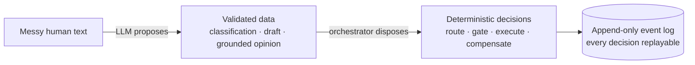
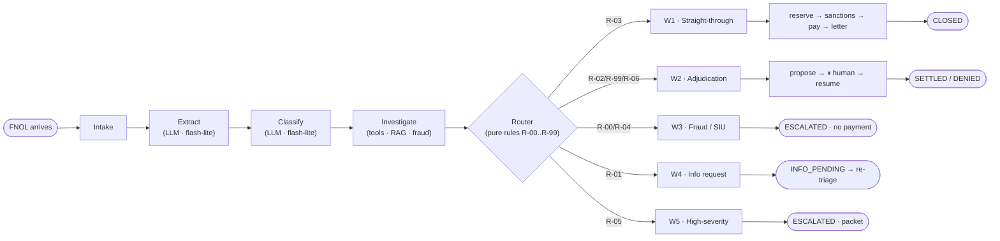
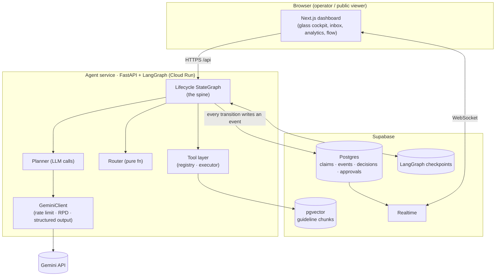
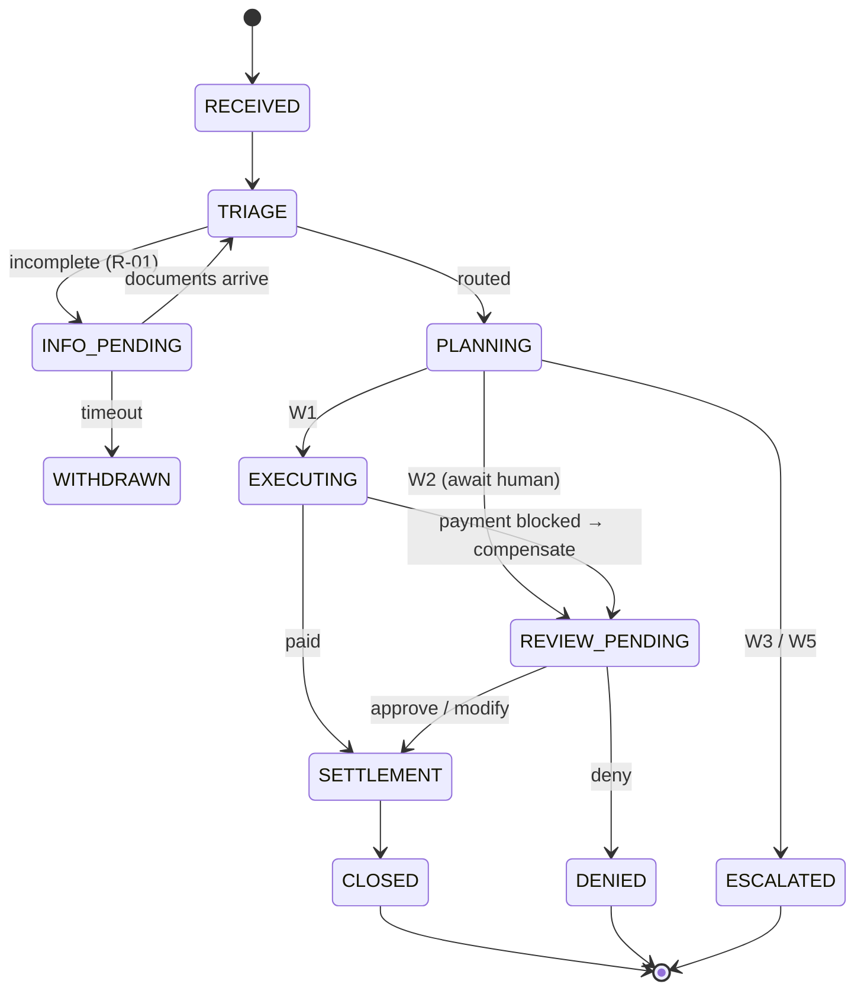
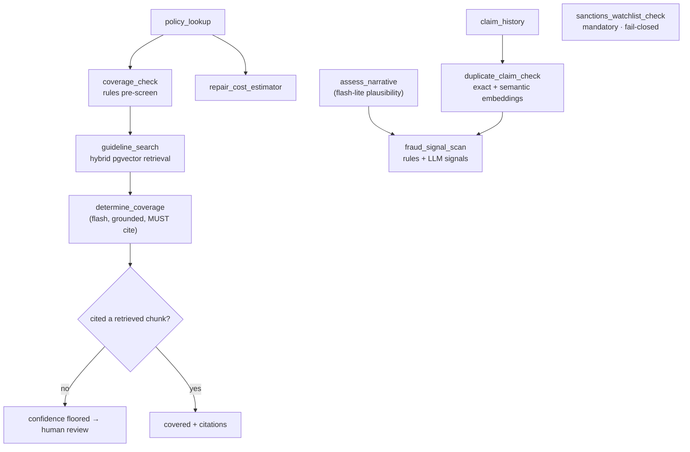
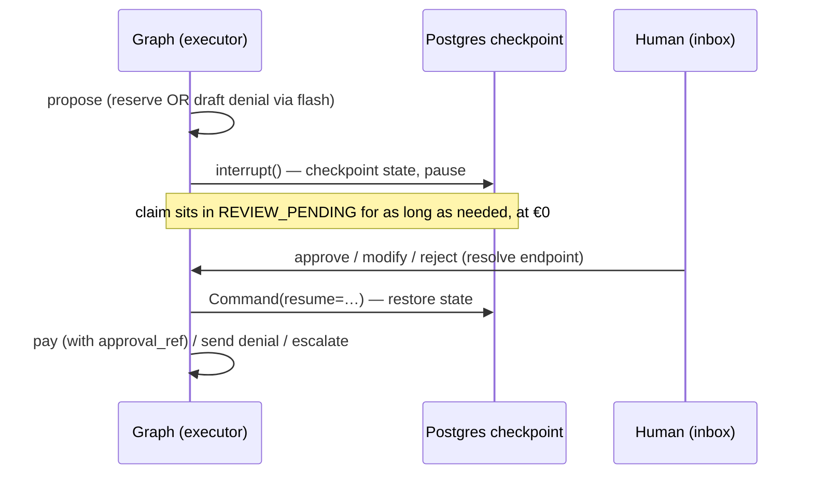
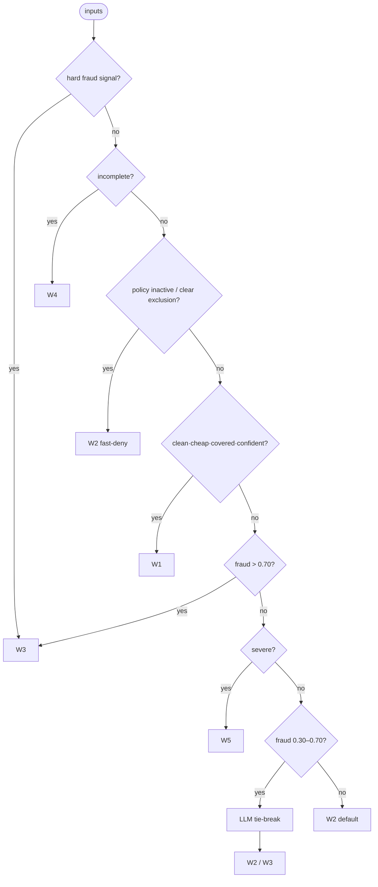

# Adjuster Zero — The Complete Manual

> **What this document is.** A from-scratch, end-to-end explanation of how Adjuster
> Zero works: every phase, every step, what is called, what technology is used, and
> *why* it is built this way. It is written so a **non-technical reader** can follow
> the story and a **senior engineer** finds the depth they expect.
>
> **How to read it.** If you just want the idea, read §1–§4 (plain English + one
> worked example). If you want the engineering, continue through §5–§16. There is a
> **glossary (§17)** — any unfamiliar term (FNOL, RAG, idempotency, checkpointer…)
> is defined there.
>
> **See it live:** Live flow `…/flow` · How it works `…/how` · Queue `…/queue`.
> All data is 100% synthetic. Running cost: ~€0/month.

---

## Table of contents

1. [The idea in one breath](#1-the-idea-in-one-breath)
2. [The one rule that matters](#2-the-one-rule-that-matters)
3. [The big picture (architecture + stack)](#3-the-big-picture)
4. [A claim, walked end-to-end (worked example)](#4-a-claim-walked-end-to-end)
5. [The lifecycle, phase by phase](#5-the-lifecycle-phase-by-phase)
6. [Inside “Investigate” — agentic RAG + fraud](#6-inside-investigate--agentic-rag--fraud)
7. [The five workflows](#7-the-five-workflows)
8. [The routing rules R-00…R-99](#8-the-routing-rules-r-00r-99)
9. [The tools (the agent’s hands)](#9-the-tools-the-agents-hands)
10. [Agentic RAG, explained properly](#10-agentic-rag-explained-properly)
11. [Human-in-the-loop (pause & resume)](#11-human-in-the-loop-pause--resume)
12. [The safety system (the non-negotiables)](#12-the-safety-system)
13. [Observability & evaluation](#13-observability--evaluation)
14. [The data model](#14-the-data-model)
15. [Technology & the AWS ↔ zero-cost mapping](#15-technology--the-aws--zero-cost-mapping)
16. [Cost & the free-tier math](#16-cost--the-free-tier-math)
17. [Glossary](#17-glossary)
18. [An adversarial example (the “alien monster”)](#18-an-adversarial-example)

---

## 1. The idea in one breath

An insurance claim arrives (someone’s windshield cracked). A human “adjuster”
normally reads it, checks the policy, decides if it’s covered, screens for fraud,
estimates the cost, and either pays it or escalates it. **Adjuster Zero is the
*zeroth* adjuster that touches every claim**: it does the routine majority
automatically in seconds, prepares the complex minority so a human starts at 80%
done, and **proves every decision** with a complete paper trail.

**Plain-English analogy.** Think of a very fast, very careful junior clerk who:

- reads the claim and fills in a form (that’s the AI part),
- but is **never allowed to sign a cheque** on their own,
- always follows a written rulebook to decide what to do next,
- and writes down *everything* they did, why, and how sure they were.

The “AI” writes; a strict, auditable **rulebook + workflow engine** decides and
acts. That separation is the whole point.

---

## 2. The one rule that matters

> **The LLM proposes; the orchestrator disposes.**

- The **LLM** (the language model, here Google **Gemini**) is allowed to be
  *creative*: it reads messy text and turns it into structured data, classifies the
  claim, drafts letters, and grounds a coverage opinion in the rulebook.
- The **orchestrator** (a deterministic **state machine**) is the boss: it decides
  the route, opens the gates, calls the tools, moves money, and cleans up failures.

Every single thing the LLM outputs is treated as **data that must be validated**,
never as a command. **Money never moves** without either a hard-coded policy tier
or a human signature.

**Why this matters (the interview line):** *the scarce skill in 2026 is not
prompting — it is drawing the line between what a probabilistic model may decide and
what deterministic code must decide, and enforcing that line in the architecture.*



---

## 3. The big picture

### 3.1 The full flow at a glance



### 3.2 Component map (who talks to whom)



### 3.3 The technology, and what each piece is for

| Layer | Technology | In one sentence |
|---|---|---|
| Agent service | **Python 3.12 · FastAPI · LangGraph** | The brain’s spine: a durable state machine that runs each claim. |
| LLM | **Gemini** (`2.5-flash-lite` default, `2.5-flash` for hard calls) | Turns messy text into validated data; drafts; grounds opinions. |
| Embeddings / RAG | **gemini-embedding-001 + pgvector** | Finds the relevant guideline passages to ground coverage decisions. |
| Durable state / HITL | **LangGraph PostgresSaver** | Lets a claim pause for a human for days at zero cost and survive restarts. |
| Database | **Supabase Postgres** | System of record: claims, events, decisions, approvals, config. |
| Live updates | **Supabase Realtime** | Pushes every event to the dashboard with no page refresh. |
| Web | **Next.js 15 · Tailwind · shadcn (Vercel)** | The “glass cockpit” you watch the agent think in. |
| CI / cron | **GitHub Actions** | Tests, weekly evals, daily keep-alive ping. |
| Tracing | **LangSmith** (optional) + our own decision log | End-to-end trace of every run. |
| Hosting | **Cloud Run** (scale-to-zero) + **Vercel** | Live, public, ~€0/month. |

---

## 4. A claim, walked end-to-end

Let’s follow one real claim — a cracked windshield — through the entire system.
This is the “so clear a layperson gets it” section; the exact data shown is what the
running system actually produces.

**The message the claimant sends (the FNOL):**

> *“A rock hit my windshield on I-80 near Sacramento yesterday and cracked the
> glass. No other damage, nobody hurt. My policy number is POL-88341.”*

**Step 0 — Intake.** The system creates a claim record (`CLM-2026-…`), stamps a
`trace_id`, and writes the first event `claim.received`. No AI yet.

**Step 1 — Extract (Gemini flash-lite).** The model reads the text and returns
*structured data* (validated against a schema):

```json
{ "fields": { "policy_number": "POL-88341", "loss_date": "2026-06-08",
              "loss_location": "I-80 near Sacramento", "peril": "glass" },
  "missing_required": [], "overall_completeness": 1.0 }
```

**Step 2 — Classify (Gemini flash-lite).**

```json
{ "line": "auto", "peril": "glass", "severity": 1, "complexity": "low",
  "injury_flag": false, "attorney_flag": false, "confidence": 0.95,
  "alternatives": [{ "label": "collision", "p": 0.05 }] }
```

**Step 3 — Investigate.** The orchestrator calls read-only tools and grounds a
coverage opinion:

- `policy_lookup("POL-88341")` → active, carries `AUTO-COMP` (comprehensive).
- `coverage_check` (rules pre-screen) → covered (glass falls under comprehensive).
- `guideline_search("glass coverage…")` → retrieves chunks `G-AUTO-GLASS#c0`,
  `G-AUTO-GLASS#c2`, … from **pgvector**.
- `determine_coverage` (Gemini flash, grounded) → **covered, confidence 1.00,
  citations `[G-AUTO-GLASS#c0, G-AUTO-GLASS#c2]`**.
- `repair_cost_estimator` → **$411.20**.
- `claim_history` + `duplicate_claim_check` → no priors, no duplicates.
- `assess_narrative` (Gemini flash-lite) → **plausible** (a rock cracking glass is mundane).
- `fraud_signal_scan` → **score 0.05** (only the weak “first seen” signal).

**Step 4 — Route (pure function).** With `fraud 0.05 < 0.30`, `severity 1 ≤ 2`,
`amount 411 ≤ 2500`, `covered = true`, `coverage confidence 1.00 ≥ 0.85` → **rule
R-03 fires → workflow W1 (straight-through)**. The decision is logged with
`rule_id=R-03` and the `config_version`.

**Step 5 — Execute (W1).** `reserve_set($411.20)` → `sanctions_watchlist_check`
(clear) → `payment_execute` with a **tier-0 policy gate** → `customer_comm_send`
(settlement letter, draft) → **SETTLED → CLOSED**.

**The timeline the operator sees (live):**

```
claim.received      {custom: true, fnol_chars: 152}
claim.extracted     {completeness: 1, missing: []}
claim.classified    {line: auto, peril: glass, severity: 1, confidence: 0.95}
claim.investigated  {covered: true, citations: [G-AUTO-GLASS#c0, G-AUTO-GLASS#c2], amount_est: 411.2, fraud_score: 0.05}
claim.routed        {rule_id: R-03, workflow: W1, rationale: "fraud 0.05<0.3, sev 1<=2, amount 411<=2500, coverage conf 1.00>=0.85 -> auto-pay"}
claim.executing     {plan: [reserve_set, payment_execute, customer_comm_send]}
claim.settled       {paid: 411.2}
claim.closed        {}
```

Total: ~6 tool calls, a handful of LLM calls, a few cents of tokens, **CLOSED in
seconds** — with a full audit trail. Now change one word in the message — *“an alien
monster hit my windshield”* — and the same engine **refuses to auto-pay** (see §18).

---

## 5. The lifecycle, phase by phase

The lifecycle is a **LangGraph `StateGraph`** — a directed graph of nodes. The
claim’s working memory (the **Claim Aggregate**, a Pydantic object) flows through
it; each node updates it and emits an event. Below, every phase is broken down:
**what happens · who does it · in → out · tools/tech · guardrail · failure mode.**

### Phase 0 — Intake
- **What:** normalize the incoming FNOL into a Claim Aggregate; assign IDs; emit `claim.received`.
- **Who:** deterministic code (no LLM).
- **In → Out:** raw FNOL text → a claim row in state `RECEIVED`.
- **Guardrail:** deliberately dumb — malformed input fails here, cheaply, before any model is called.

### Phase 1 — Extract
- **What:** turn free text into typed fields with per-field confidence + a completeness score.
- **Who:** **Gemini flash-lite** via `extract_fnol_fields`.
- **In → Out:** FNOL text → `FnolExtraction` (fields, missing_required, completeness).
- **Tech:** Gemini structured output (`response_schema`) + Pydantic validation.
- **Guardrail:** schema-validated; **exactly one repair retry** on failure, then escalate. Never a silent loop.
- **Failure mode:** unreadable input → low completeness → later routed to W4 (information request).

### Phase 2 — Classify
- **What:** line / peril / severity (1–5) / complexity / injury & attorney flags + alternatives.
- **Who:** **Gemini flash-lite** via `claim_classifier`.
- **Guardrail:** if the top-two labels are close, it lowers its own confidence rather than guessing; confidence becomes a routing input.

### Phase 3 — Investigate
- **What:** gather every fact the router needs (policy, coverage, amount, history, duplicates, fraud, narrative plausibility, weather).
- **Who:** the orchestrator runs **read-only (T0) tools** + two LLM sub-steps (coverage determination, narrative screen). Detailed in §6.
- **Guardrail:** tolerant of missing data (no policy number → it simply can’t look one up); a degraded fraud control caps routing at W2.

### Phase 4 — Route
- **What:** choose one of five workflows by evaluating rules R-00…R-99 top-down.
- **Who:** a **pure function** (no I/O, no clock, no randomness). Only the ambiguous fraud band (R-06) calls the LLM to break the tie. Detailed in §8.
- **Guardrail:** thresholds come from a **versioned config row**; `rule_id` + `config_version` are recorded, so any past decision is reproducible and policy changes are testable against history.

### Phase 5 — Execute (per workflow)
- **What:** the executor walks the chosen workflow’s steps. Detailed in §7.
- **Who:** deterministic executor + tools (+ human for W2). 
- **Guardrail:** the executor rejects any tool not on the workflow’s allow-list; bounded by **max 2 replans** and a **per-claim token budget**.

### Phase 6 — Settle / Close / Park / Escalate (terminal)
- **What:** book the settlement and close (W1/approved W2), park awaiting documents (W4) or a human (W2), or escalate with a packet (W3/W5).
- **Guardrail:** **no transition into settlement without coverage = true AND (tier-0 gate OR an approval record).**

### Phase 7 — Record (cross-cutting)
- **What:** every transition writes a `claim_events` row in the **same transaction** as the projection update; decisions and tool calls are first-class rows.
- **Tech:** Postgres transaction; Supabase Realtime streams it to the dashboard.



---

## 6. Inside “Investigate” — agentic RAG + fraud

This phase is where the “agentic RAG” lives. The orchestrator (not the LLM) decides
which read-only tools to call, in order, and feeds the results to the router.



**Each sub-step:**

- **`policy_lookup`** — fetch the policy from the (mock) policy-admin system: status, coverages, deductibles.
- **`coverage_check`** — a fast, rules-only pre-screen: is the policy active on the loss date, and does the peril map to a coverage code it carries?
- **`guideline_search`** — **RAG retrieval**: a hybrid of keyword (Postgres full-text) and vector (pgvector kNN) search over the guideline corpus, fused by reciprocal-rank fusion. Returns the most relevant guideline chunks.
- **`determine_coverage`** — **Gemini flash**, given the policy facts *and* the retrieved chunks, makes the coverage call and **must cite chunk IDs**. If the citation doesn’t match a retrieved chunk, confidence is **floored to 0.5** → the claim is forced to human review (this is the anti-hallucination guarantee).
- **`repair_cost_estimator`** — a line-item estimate from a parts/labor table → the claimed amount.
- **`claim_history`** — the claimant’s prior claims and 24-month count.
- **`duplicate_claim_check`** — **exact** match (same claimant/peril/date window) **and semantic** match (narrative embeddings, cosine ≥ 0.82) — so a *paraphrased* duplicate still gets caught.
- **`assess_narrative`** — **Gemini flash-lite** judges whether the loss cause is *physically plausible and coherent*. An impossible/fictional cause is a strong fraud signal (see §18).
- **`sanctions_watchlist_check`** — mandatory pre-payment screen; if the service is down, **all payments are blocked** (fail-closed).
- **`fraud_signal_scan`** — combines the above into a 0–1 score with **itemized, weighted signals + evidence** (e.g. `DUP_NARRATIVE 0.35`, `NARRATIVE_IMPLAUSIBLE 0.40`, `RECENT_COVERAGE_INCREASE 0.20`, `FREQUENT_CLAIMS 0.20`, `FIRST_SEEN 0.05`).

---

## 7. The five workflows

The router picks exactly one. Each is a typed program the executor runs.

| ID | Workflow | When it fires | Human touch | Terminal |
|----|----------|---------------|-------------|----------|
| **W1** | Straight-through processing | clean, cheap, low-severity, covered, low fraud | none (tier-0 gate) | CLOSED (auto-paid) |
| **W2** | Standard adjudication / fast-deny | medium / default / lapsed policy | approve · modify · reject | SETTLED or DENIED |
| **W3** | Fraud investigation (SIU) | fraud > 0.70 or a hard signal | human-led | ESCALATED (**no payment edge**) |
| **W4** | Information request loop | incomplete / low-confidence extraction | none (claimant-facing) | re-triage on docs / WITHDRAWN |
| **W5** | High-severity escalation | severity ≥ 4, injury, amount > $25k, attorney, weak coverage | human-led | ESCALATED (with packet) |

**W1 (auto-pay):** `reserve_set → sanctions_watchlist_check → payment_execute
(tier-0 gate) → customer_comm_send → SETTLEMENT → CLOSED`. If the payment is blocked
(e.g. sanctions down), a **compensation saga** restores the reserve and parks the
claim for review.

**W2 (human-in-the-loop):**



A **Modify** captures a structured delta + reason code (e.g. “reduce payout by
depreciation”). That override data feeds the calibration chart.

**W3 (fraud):** prepares a hand-off packet for SIU and escalates. **No path in the
graph or the tool allow-list can reach `payment_execute` from W3** — provable, not
prompted. **W4:** issues a `document_request_create`, parks in `INFO_PENDING`, and
re-triages when documents arrive (bounded by the replan counter). **W5:** prepares a
packet for a senior adjuster.

---

## 8. The routing rules R-00…R-99

Routing is a **policy decision, not a vibe.** A pure function evaluates the table
top-down; the first match wins. Thresholds come from a versioned `config` row.

| Rule | Condition (plain English) | Route |
|------|---------------------------|-------|
| **R-00** | A hard fraud signal (watchlist hit or exact-duplicate claim) | **W3** |
| **R-01** | The claim is incomplete (completeness < 0.90) or a key field is low-confidence | **W4** |
| **R-02** | The policy was not active at the loss date, or a clear exclusion applies | **W2** (fast-deny) |
| **R-03** | Clean + cheap + low-severity + covered + high confidence | **W1** (auto-pay) |
| **R-04** | Fraud score above the high threshold (> 0.70) | **W3** |
| **R-05** | Severe: severity ≥ 4, injury, amount > $25k, attorney, or weak coverage confidence | **W5** |
| **R-06** | Fraud in the ambiguous band (0.30–0.70) → **LLM tie-break** with guidelines | **W2 or W3** |
| **R-99** | Nothing else matched | **W2** (standard) |

**Default thresholds (hot-editable in `config`):** auto-pay ceiling `$2,500`, fraud
low `0.30`, fraud high `0.70`, STP severity ≤ `2`, coverage confidence ≥ `0.85`,
completeness ≥ `0.90`, high-severity ≥ `4`, high-amount > `$25,000`.

**Worked outcomes:**

| FNOL | Key inputs | Rule | Workflow |
|------|-----------|------|----------|
| Clean glass, POL-88341 | covered, fraud 0.05, sev 1, $411 | R-03 | W1 → CLOSED |
| Same, POL-77120 (lapsed) | policy inactive at loss | R-02 | W2 → DENIED (after approval) |
| “I had an accident”, no policy # | completeness 0.45 | R-01 | W4 → INFO_PENDING |
| Theft, 3 priors + near-dup narrative | exact duplicate | R-00 | W3 → ESCALATED |
| Collision, severity 4 | severity ≥ 4 | R-05 | W5 → ESCALATED |
| “Alien monster” glass | fraud 0.45 (implausible) | R-06 → tiebreak | W2/W3 (review) |



---

## 9. The tools (the agent’s hands)

Every tool is registered with a name, input/output schemas, a **risk tier**, an
idempotency flag, and a handler. The executor validates arguments *before* calling
and the result *after*, enforces the workflow allow-list, and returns a uniform
`{ok, data | error}` envelope. **Risk tiers:** **T0** read-only · **T1** reversible
writes · **T2** money / external comms.

| Tool | Tier | What it does (mock) | Notable failure handling |
|------|------|---------------------|---------------------------|
| `policy_lookup` | T0 | Fetch policy record | not found → escalate |
| `coverage_check` | T0 | Rules coverage pre-screen | — |
| `guideline_search` | T0 | Hybrid RAG retrieval (pgvector) | low relevance → “no grounding” |
| `repair_cost_estimator` | T0 | Line-item estimate | partial → flags, blocks STP |
| `claim_history` | T0 | Prior claims / loss ratio | none → “first seen” |
| `duplicate_claim_check` | T0 | Exact + semantic duplicates | index down → degraded mode |
| `weather_event_verify` | T0 | Corroborate weather perils (mock NOAA) | unverified is a *finding*, not an error |
| `fraud_signal_scan` | T0 | Score + itemized signals | unavailable sub-check → conservative routing |
| `sanctions_watchlist_check` | T0 | OFAC-style screen | **down → all payments blocked (fail-closed)** |
| `reserve_set` | **T1** | Set/adjust reserve | idempotent via key |
| `document_request_create` | T1 | Open the W4 loop | notification best-effort; state is truth |
| `escalate_to_human` | T1 | Create a human task | the universal exit |
| `customer_comm_send` | **T2** (send) / T0 (draft) | Draft/send claimant letters | missing merge field → fails loudly |
| `payment_execute` | **T2** | Disburse settlement (mock ACH) | **requires a gate/approval ref to even construct**; idempotent; reconcile-before-retry |

(The blueprint’s full catalogue is 18 tools; the live system implements the set
above — the rest, like `vehicle_valuation` and `inspection_schedule`, are documented
for the production profile.)

---

## 10. Agentic RAG, explained properly

**For a layperson.** RAG (“Retrieval-Augmented Generation”) means: before the AI
answers, we *look up the relevant pages of the rulebook* and hand them to it, so its
answer is grounded in real rules instead of made up. Here, the “rulebook” is a set
of underwriting guidelines, and the AI must **cite which page it used**.

**How it works here:**

1. **Corpus.** ~12 short guideline documents (auto glass, collision, comprehensive,
   weather/hail, theft, water, fire, exclusions, lapse rules, deductibles, fraud
   indicators, injury). Written as Markdown in `db/guidelines/`.
2. **Chunking.** Each document is split by section into small **chunks** with stable
   IDs like `G-AUTO-GLASS#c0`.
3. **Embeddings.** Each chunk is turned into a 768-number vector with
   **gemini-embedding-001** and stored in **pgvector** (a vector column in Postgres).
4. **Hybrid retrieval.** For a query, we combine **keyword** search (Postgres
   full-text) and **vector** search (cosine nearest-neighbours) and fuse the two
   rankings (reciprocal-rank fusion). This catches both exact terms and meaning.
5. **Grounded determination.** Gemini flash decides coverage *using the policy facts
   plus the retrieved chunks* and must return citations.
6. **Citation enforcement (the safety net).** A validator checks the citations are
   real retrieved chunks. **No valid citation → confidence floored to 0.5 → forced
   human review.** A “citation” to an irrelevant chunk doesn’t count.

**Why this is not a “RAG chatbot.”** A chatbot *answers*; this *acts* — it routes,
moves money, pauses for humans, and audits itself. RAG is one subsystem used as
**grounding for a consequential decision**, with enforced citations — not a search
box with vibes.

> *Offline note:* with no API key, a deterministic local embedder + in-memory index
> stand in, so retrieval and semantic duplicate detection still run in tests/CI.

---

## 11. Human-in-the-loop (pause & resume)

Some decisions must be signed by a person (paying a non-trivial claim; denying one).
The system pauses for them — durably.

**Plain analogy.** It’s like pausing a board game and taking a photo of the board.
You can walk away for days; when you come back, you restore the exact position and
keep playing. The “photo” is a **checkpoint** saved in Postgres.

**Mechanically:** the W2 workflow calls LangGraph’s `interrupt()`. The graph state is
**checkpointed to Postgres** and the run stops (state `REVIEW_PENDING`). The claim
costs nothing while paused (the server scales to zero). An operator opens the
**Approval Inbox**, sees the request with evidence, confidence and alternatives, and
chooses **Approve / Modify / Reject**. The resolve endpoint calls
`Command(resume=…)`, the graph restores its state and continues — paying with an
`approval_ref`, sending a denial, or escalating.

**It survives a restart.** Because the state lives in the checkpointer (not in
memory), you can kill and restart the agent service mid-pause and the approval still
resumes correctly. This is the durable analogue of AWS Step Functions
`waitForTaskToken` — *same pattern, two implementations.*

---

## 12. The safety system

These are the non-negotiable guarantees, each enforced structurally (not by hoping
the model behaves).

1. **The LLM never owns control flow.** Outputs are validated data; a deterministic
   machine acts.
2. **Structured output + one repair.** Every LLM call is schema-validated; one repair
   retry, then escalate. (Hallucination proxy #1: schema-violation rate.)
3. **Routing is a pure, versioned, replayable function.** Policy changes are testable
   against history before they ship.
4. **Risk tiers, enforced by construction.** `payment_execute` *cannot be built*
   without an authorization carrying a policy-gate or approval reference — the
   invalid call is unrepresentable. W3/W4/W5 have **no payment edge**.
5. **Event-sourced core.** The event *is* the transition; audit trail, dashboard
   feed and replay substrate are one mechanism.
6. **Fail-closed compliance.** Sanctions service down → all payments halt. A degraded
   fraud control → routing capped at W2 (no straight-through).
7. **Idempotency + compensation.** Payments carry idempotency keys and reconcile
   before any retry; a failed/blocked payment restores the reserve and parks for
   review (a saga).
8. **Citations enforced.** Uncited coverage determinations are confidence-floored to
   human review.
9. **Narrative plausibility.** A physically impossible/fictional cause is a fraud
   signal — it cannot straight-through.
10. **Bounded autonomy.** Max 2 replans + a per-claim token budget; exhaustion
    escalates (a runaway loop is a cost incident, so it can’t happen).

---

## 13. Observability & evaluation

- **Decision log.** Every decision is a first-class row: type, model, confidence,
  alternatives with probabilities, citations, guardrail results, tokens, latency.
  Rendered in the cockpit (not log lines).
- **“Chose NOT to” panel.** The tools the planner skipped, with one-line reasons.
- **Calibration chart.** Predicted confidence vs. human-agreement by bucket — does a
  “0.9” mean anything? Fed by approval resolutions.
- **RPD budget meter.** Daily request/token counters per model (free-tier discipline).
- **Per-tool failure table & funnel & STP/override/cost KPIs.**
- **Evals as a gate.** 50 labeled golden claims replay through the **real graph** and
  produce a route confusion matrix + pass rate (≥ 92% target). Wired to a weekly
  GitHub Action and an admin “Run evals” button (with an RPD-budget guard).
- **Trace.** A `trace_id` minted at intake flows into every event; LangSmith tracing
  is env-gated.

---

## 14. The data model

All in Supabase Postgres (the relational mirror of the production DynamoDB design).

| Table | What it holds |
|---|---|
| `claims` | The claim aggregate (a projection): state, workflow, peril, severity, fraud score, amounts. |
| `claim_events` | **The system of record** — append-only event log; the claim is a projection of these. |
| `agent_decisions` | Every LLM/routing decision with confidence, alternatives, citations, guardrails, tokens, latency. |
| `tool_calls` | Every tool invocation: args, result, risk tier, idempotency key, latency, cached flag. |
| `approvals` | Human-approval tasks: requested action, evidence, confidence, resolution, delta, reason code. |
| `workflow_executions` | Per-claim execution: workflow, replan count, token budget used. |
| `config` | Versioned routing thresholds (hot-reload; old versions retained for reproducibility). |
| `guideline_chunks` | The RAG corpus: chunk text + 768-dim embedding (pgvector). |
| `llm_usage` | Daily per-model request/token counters (the RPD meter). |
| `eval_runs` | Eval history: route/terminal accuracy + the full report. |
| `leads` | The contact-form agent’s captured leads. |
| `audit_log` | Append-only; UPDATE/DELETE revoked. |

**Security:** the agent connects with the service-role key (trusted writer, bypasses
RLS). The browser uses the anon key under **Row-Level Security**: everyone can read
(public viewer mode), only authenticated operators can write.

---

## 15. Technology & the AWS ↔ zero-cost mapping

The AWS design is the documented “production profile”; the live deployment uses an
equivalent zero-cost stack. *Same pattern, two implementations.*

| Production (AWS) | Live (zero-cost) | Pattern preserved |
|---|---|---|
| Step Functions + `waitForTaskToken` | LangGraph + PostgresSaver + `interrupt()` | durable state machine, HITL |
| DynamoDB single-table | Supabase Postgres (relational) | decisions/tools/approvals as entities |
| SQS + DLQ | safe-fail tool envelope / Postgres queue | decoupling, poison isolation |
| EventBridge bus | `claim_events` + Supabase Realtime | event-sourcing, live cockpit |
| EventBridge Scheduler | `pg_cron` + GitHub Actions cron | 72h reminders, SLA timers |
| OpenSearch | pgvector (hybrid FTS + kNN) | RAG with citations |
| Bedrock | Gemini (`response_schema` = validation) | typed outputs, one repair |
| CloudWatch + X-Ray | LangSmith + our decision log | end-to-end `trace_id` |
| Cognito | Supabase Auth + RLS | auth, viewer/operator roles |
| S3 | Supabase Storage | FNOL documents |

---

## 16. Cost & the free-tier math

- **Models:** flash-lite (~250/day) for the cheap 80% (extract, classify, fraud,
  narrative); flash (~10 RPM) only for coverage determinations, R-06 tie-breaks, and
  letters. One `GeminiClient` enforces a token-bucket rate limiter + daily RPD
  counters; a 429 triggers backoff → automatic flash→flash-lite downgrade.
- **Per claim:** ~4–6 LLM calls, a few cents of tokens.
- **Infra:** Cloud Run scales to zero (cold start 2–5 s), Vercel Hobby, Supabase free.
- **Total:** **~€0/month.** The free-tier limits are turned into a *feature* (visible
  admission control / “rate-limited, retrying” on the timeline).

---

## 17. Glossary

- **FNOL** — *First Notice of Loss*: the initial report a claimant submits.
- **STP** — *Straight-Through Processing*: handled fully automatically, zero human touch.
- **LLM** — *Large Language Model* (here Gemini): reads/writes natural language.
- **RAG** — *Retrieval-Augmented Generation*: look up relevant documents, then have the model answer grounded in them.
- **Embedding** — a list of numbers representing a piece of text’s *meaning*, so similar meanings are numerically close.
- **pgvector** — a Postgres extension that stores embeddings and finds nearest ones.
- **State machine** — a system that is always in exactly one defined state and moves between them by defined transitions.
- **Checkpointer** — saves the graph’s exact state so a paused run can resume later (even after a restart).
- **interrupt() / resume** — LangGraph’s pause-for-a-human mechanism.
- **Idempotency key** — a unique tag so doing the same operation twice has the effect of doing it once (you can’t double-pay).
- **Saga / compensation** — if a multi-step action fails, undo the earlier steps (restore the reserve).
- **Risk tier (T0/T1/T2)** — read-only / reversible write / money-or-comms.
- **Event sourcing** — the log of events is the truth; current state is computed from it.
- **RLS** — *Row-Level Security*: database rules that decide who can read/write each row.
- **Scale-to-zero** — the server sleeps when idle (costs nothing) and wakes on the next request.
- **RPD / RPM** — requests-per-day / -per-minute (free-tier limits).

---

## 18. An adversarial example

Change the clean-glass FNOL’s *cause* to something impossible:

> *“An **alien monster** hit my windshield on I-80 … cracked the glass … POL-88341.”*

Everything else is identical to the clean claim — same policy, same glass damage,
same coverage. A naive system would still auto-pay (comprehensive covers glass). Ours
does **not**:

| FNOL (only the cause differs) | Plausible? | Fraud score | Outcome |
|---|---|---|---|
| “a **rock** hit my windshield … POL-88341” | yes | 0.05 | **CLOSED · $411.20 paid** |
| “an **alien monster** hit my windshield … POL-88341” | **no** | **0.45** | **ESCALATED · $0.00 — human review** |

**Why:** `assess_narrative` (flash-lite) flags the cause as physically impossible →
a `NARRATIVE_IMPLAUSIBLE (0.40)` fraud signal → the score leaves the straight-through
band → the router sends it to review (R-06 tie-break / fraud), **never to auto-pay**.
The reason is recorded in the decision log. This is the answer to *“what happens when
the input is garbage or adversarial?”* — the model may be fooled into reading
“windshield,” but it cannot move money on an absurd story.

---

*This manual describes the live system. For the architecture spec see
[`blueprint.md`](blueprint.md); for the running list of design decisions see
[`DECISIONS.md`](DECISIONS.md); to watch it run, open the **Live flow** page.*
